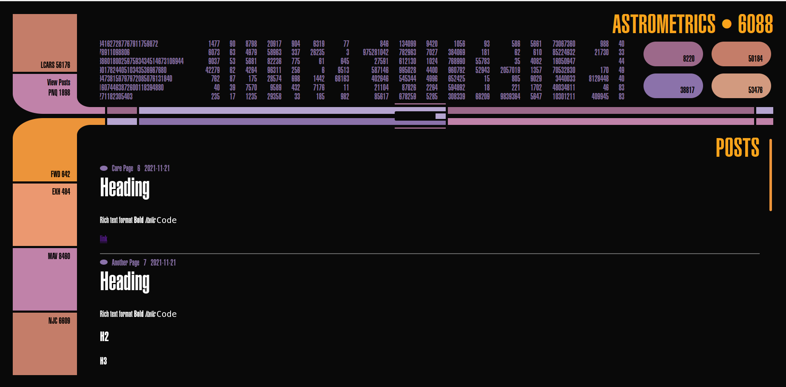

# LCARS on Wagtail

**Why Build?**

This is a fun example of what can be built with a custom CMS and Wagtail Blocks based on the theme of LCARS.  

**Description** 

In the Star Trek fictional universe set in the mid-24th Century, LCARS (Library Computer Access/Retrieval System) is an OS used by the United Federation of Planets on their starfleet vessels, starbases and space stations. Created by scenic art supervisor Michael Okuda, the flurry of activity that goes on all across the screens in The Star Trek: Next Generation, Star Trek: Deep Space Nine and Star Trek: Voyager and Star Trek: Picard has captured the hearts of fans all over.

[Wagtail]('https://docs.wagtail.io/en/stable/') is an OS python CMS (Content Management System) built on Django. To learn more about some of the capabilities of Wagtail, check out [Whats New in Wagtail 5](https://www.youtube.com/watch?v=ONI0Dfe5CU4), announcing the recent [4.1 LTS release](https://docs.wagtail.io/en/stable/releases/4.1.html) [4.1.1 patch](https://docs.wagtail.io/en/stable/releases/2.1.1.html). The backend of this application is built on Wagtail.

**Out of the box Wagtail Features:**
- Admin, Auth + Django's strong approach to security
- Rapid development environment
- `StreamField` - a special collection of blocks to write templates to control blocks displayed (implemented)
- `FormBuilder` - Flexible forms in Wagtail
- awesome-wagtail community - [https://github.com/springload/awesome-wagtail](https://github.com/springload/awesome-wagtail)

- issues: [https://github.com/dawnwages/LCARS-on-Wagtail/issues]('https://github.com/dawnwages/LCARS-on-Wagtail/issues')
- testing: TBD
- coverage: TBD

## This Project

- snowpack
- Vue 3.1
- Python 3.11
- Wagtail 4.1.1
- Django 4.0

Separated between frontend `LCARS` and backend `wagtail`. `Django Rest Framework` handles the API routes `wagtail/LCARSAPP/api.py` `wagtail/LCARSAPP/urls.py`. To learn more about Vue + Wagtail check out: [Headless Wagtail Demo](https://gist.github.com/tomdyson/abf1e973db4dcd50b388816f8c20adb0). The frontend vue application accesses this in `LCARS/http-common.js` and `LCARS/src/services/DataService.js` with axios.

### Features

- LCARS UI - https://lcars-monitor.netlify.app/
- Posts on page
- RichText, Image, Header block

### Future Features
- Deploy demo to heroku
- Basic blog elements: headers, bullets, images, embeds
- Use Wagtail Snippets to create LCARS widgets like carousels 
- Forms
- Calendar (Daily, Monthly, Weekly)
- Complex tables

## Installation

### Frontend - Vue 3.1

`npm i`

`npm run start` << will run on port 8080 without args

### Backend - Headless Wagtail CMS 4.1 (LTS)
`cd LCARSAPP`

`pip install --upgrade pip`

`pip install -r requirements.txt`

`./manage.py migrate`

`./manage.py createsuperuser`

`./manage.py runserver` << will run on port 8000 without args

# Credits

Check me out on Twitter [@BajoranEngineer](https://twitter.com/BajoranEngineer)
Masto: [@fly00gemini8712@mastodon.online](https://mastodon.online/@fly00gemini8712)
My website: [dawnwages.info](https://dawnwages.info)
Blog: [glittertech.dev](https://dawnwages.info/BajoranEngineer)

Shout out to Lou Huang [@saikofish](https://twitter.com/saikofish) for the UI!
