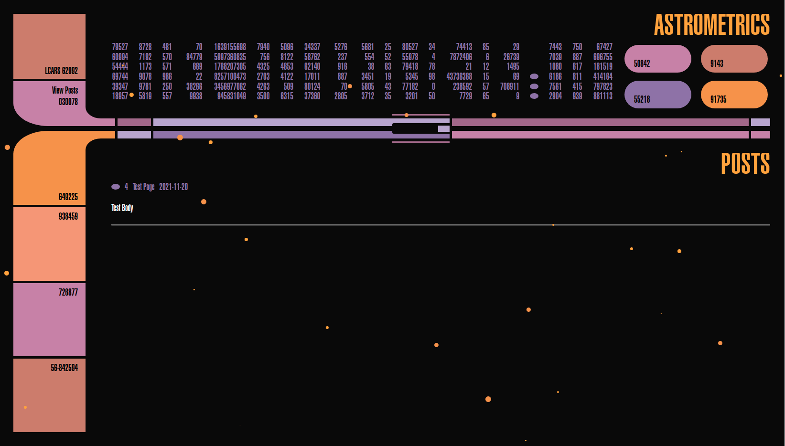

# Wagtail

Create wagtail with LCARS
view UI Demo: https://lcars-monitor.netlify.app/
UI repo: https://github.com/louh/lcars

- issues:
- testing:
- coverage

## Features

- feature
- feature
- feature

## Installation

`cd LCARSAPP`

`pip install --upgrade pip`

`pip install -r requirements.txt`

`./manage.py migrate`

`./manage.py createsuperuser`

`./manage.py runserver 8000`

# Credits

