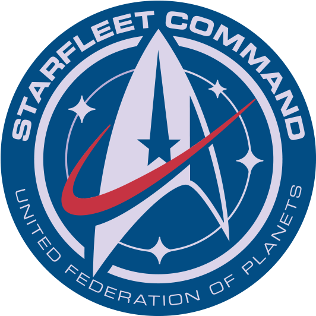
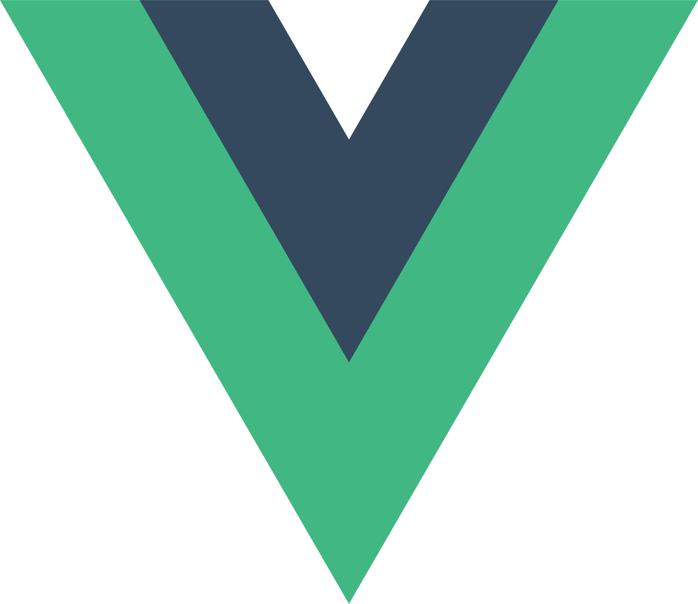
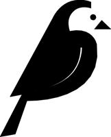
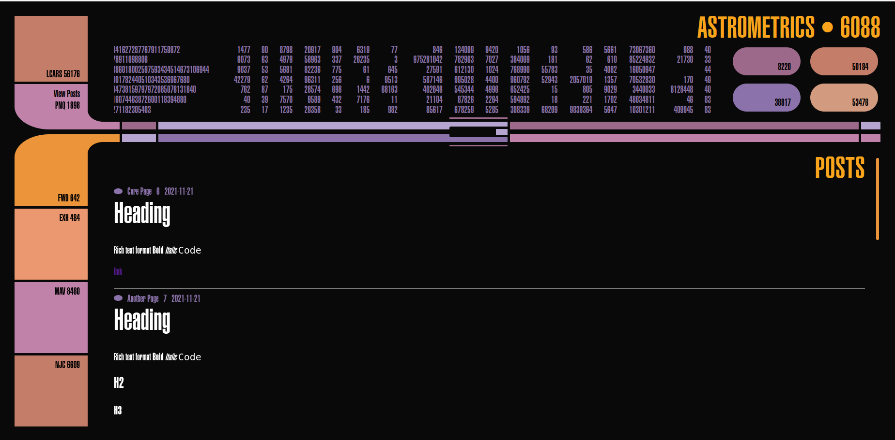

# LCARS on Wagtail


A Star Trek LCARS interface powered by a headless Wagtail CMS. Posts are written in the Wagtail admin and displayed in a Vue LCARS frontend.



**Why build?**

This is a fun example of what can be built with a custom CMS and Wagtail blocks based on the theme of LCARS.

**What is LCARS?**

In the Star Trek fictional universe set in the mid-24th century, LCARS (Library Computer Access/Retrieval System) is an OS used by the United Federation of Planets on their starfleet vessels, starbases and space stations. Created by scenic art supervisor Michael Okuda, the flurry of activity that goes on all across the screens in Star Trek: The Next Generation, Star Trek: Deep Space Nine, Star Trek: Voyager and Star Trek: Picard has captured the hearts of fans all over.

**What is Wagtail?**

[Wagtail](https://docs.wagtail.org/en/stable/) is an open source Python CMS (Content Management System) built on Django. See the [Wagtail 8.0 release notes](https://docs.wagtail.org/en/stable/releases/8.0.html) for what's new. Out of the box, Wagtail gives this project:

- Admin, auth, and Django's strong approach to security
- A rapid development environment
- `StreamField`, a collection of blocks that controls what is displayed (used here for posts)
- `FormBuilder`, flexible forms in Wagtail
- The [awesome-wagtail](https://github.com/wagtail/awesome-wagtail) community

## This project

| Part | Stack | Location |
|---|---|---|
| Frontend | Vue 3.5, Vite 8, axios | `LCARS/` |
| Backend | Python 3.14, Django 6.1, Wagtail 8.0, Django REST Framework | `wagtail/LCARSAPP/` |

The backend exposes Wagtail's v2 API (`wagtail/LCARSAPP/LCARSAPP/api.py`, routed in `wagtail/LCARSAPP/LCARSAPP/urls.py`). The frontend reads posts from it with axios in `LCARS/src/http-common.js` and `LCARS/src/services/DataService.js`:

```
GET http://localhost:8000/api/v2/pages/?type=core.CorePage&fields=intro,body,id,date
```

To learn more about Vue + Wagtail, check out the [Headless Wagtail Demo](https://gist.github.com/tomdyson/abf1e973db4dcd50b388816f8c20adb0).

### Features

- LCARS UI, based on [lcars-monitor](https://lcars-monitor.netlify.app/)
- Posts on page
- Heading, rich text, and image blocks
- External links in rich text are rendered with `rel="nofollow"`

### Future features

- Deploy demo to Heroku
- Basic blog elements: headers, bullets, images, embeds
- Use Wagtail Snippets to create LCARS widgets like carousels
- Forms
- Calendar (daily, monthly, weekly)
- Complex tables

## Installation

You need [uv](https://docs.astral.sh/uv/) for the backend and Node.js for the frontend. Run the backend and frontend in separate terminals.

### Backend: headless Wagtail CMS

```bash
cd wagtail/LCARSAPP
uv venv
uv pip sync requirements.txt
uv run python manage.py migrate
uv run python manage.py createsuperuser
uv run python manage.py runserver
```

The API runs at http://localhost:8000/api/v2/ and the Wagtail admin at http://localhost:8000/admin/. Create a **Core page** under the home page in the admin to see it in the frontend.

### Frontend: Vue + Vite

```bash
cd LCARS
npm install
npm start
```

The app runs at http://localhost:8080, the origin the backend's CORS settings allow. `npm run build` creates a production build in `LCARS/dist/`.

## Testing

```bash
cd wagtail/LCARSAPP
uv run python manage.py test
```

The tests pin the API responses the frontend depends on (post fields, StreamField blocks, image renditions), plus CORS, the admin, the page editor, and search. Run them before and after any upgrade.

## Developer path

This project uses [uv](https://docs.astral.sh/uv/) for Python:

- Python is installed and managed by uv, pinned in `wagtail/LCARSAPP/.python-version` (3.14). Don't use the macOS system `python3` or Homebrew Python.
- One virtual environment per project, `wagtail/LCARSAPP/.venv`, created with `uv venv`.
- Top-level packages are listed in `requirements.in` and pinned in `requirements.txt`. uv environments have no `pip`, so "No module named pip" is expected.
- Run commands with `uv run ...`, or after `source .venv/bin/activate`.

To upgrade Python dependencies to their latest versions:

```bash
cd wagtail/LCARSAPP
uv pip compile requirements.in -o requirements.txt --upgrade
uv pip sync requirements.txt
uv run python manage.py makemigrations --check
uv run python manage.py test
```

## Contributing

Questions and bug reports are welcome in [issues](https://github.com/dawnwages/LCARS-on-Wagtail/issues).

## License

[GPL-3.0](LICENSE), the same license as the [LCARS UI](https://github.com/louh/lcars) this project builds on.

## Credits

Shout out to Lou Huang ([@saikofish](https://twitter.com/saikofish), [louh/lcars](https://github.com/louh/lcars)) for the UI!

Built by Dawn Wages:

- Website: [dawnwages.info](https://dawnwages.info)
- Blog: [Bajoran Engineer](https://dawnwages.info/bajoran-engineer/)
- Twitter: [@BajoranEngineer](https://twitter.com/BajoranEngineer)
- Mastodon: [@fly00gemini8712@mastodon.online](https://mastodon.online/@fly00gemini8712)
